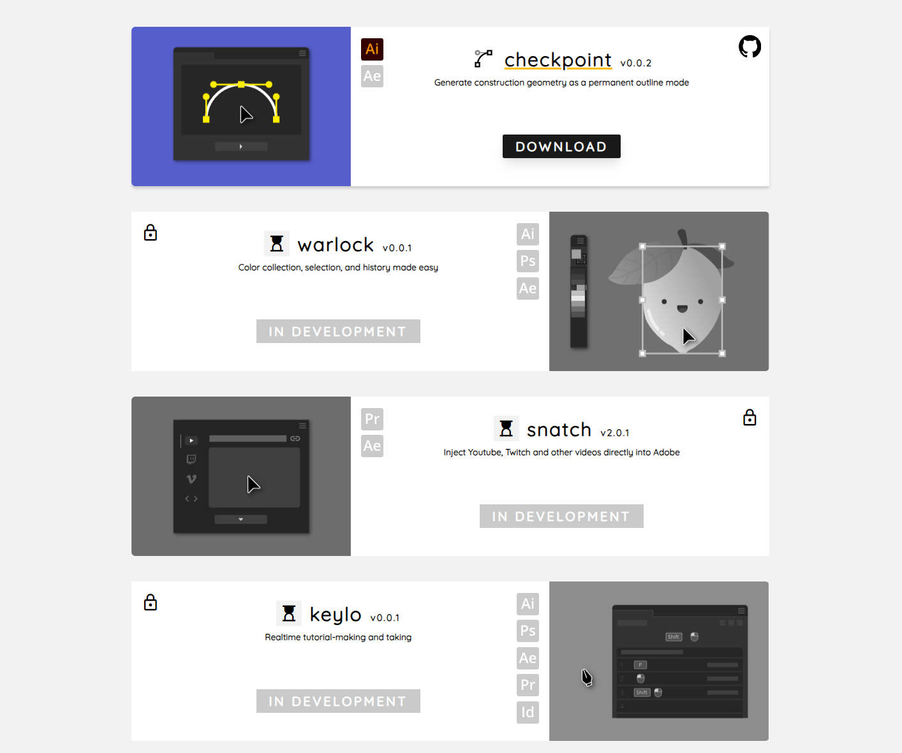

### Downloads do not work yet because I'm just focusing on design.

I've thought a lot about what I want in a website, looking at others' like Lovatt or Battleaxe over the last few years and seeing how often they're updated and what goes into updating them, and so on. I want to do this in as clean and simple of a way that'd be easy to modify and organize in the future. What I have so far is this:

```html
<card repo="checkpoint" :disabledHosts="[{ name: 'AEFT', disabled: true }]">
  <template v-slot:logo>
    <iconCheckpoint />
  </template>
  <template v-slot:animation>
    <lottiePreviewVue name="checkpoint" :data="checkpointAnimation" />
  </template>
</card>
```

With the exception of the Lottie file and logo, all the data in the screenshot above for Checkpoint is being fetched on site load from my Github in realtime -- name, version, github link, download link, app host list, and more which isn't displayed. All I supply is the repo's namespace. I just need to update Checkpoint's (or any other tool's) repo without ever needing to touch the site, and all the data here will _always_ be up to date without me ever updating it manually. You could do this through Github tokens as well to access private repos _but open source keeps things simple and I don't really need or want your money_.

Particularly happy with the animation here, which acts differently depending on desktop or mobile, and has hover logic on the card to display in color and play then when hovered off will go back to monochrome and pause at the next segment. I've missed doing fun / simple animation and giving it interacivity with code.
